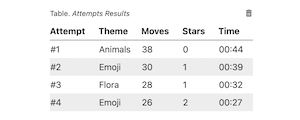

# Project #2. Memory Game
The Memory Game Project is the second self-paced project in _Udacity Nanodegree Program_.

_Memory Game_ is a complete browser-based card matching game (also known as _Concentration_). For more information see this [article](https://en.wikipedia.org/wiki/Concentration_(game)) in Wikipedia.

## How the Game Works
The game board consists of sixteen “cards” arranged in a grid. The deck is made up of eight different pairs of cards, each with different symbols on one side. The game supports three different sets of symbols — themes: _emoji_, _flora_, _animals_.

The cards are arranged randomly on the grid with the symbol face down.

## Gameplay
The gameplay rules are very simple: flip over two hidden cards at a time to locate the ones that match!

## Interface

### Stats Panel

Parts of the _Stats Panel_ (left to right):

1. Star Rating
1. Moves Counter
1. Timer
1. **Reset Game** button

### Game Board

### Attempts Results Table
The game stores the results of a user's attempts using browser's local storage.

To clear the table use **Clear Results** button .

## Game Launch
To start the game open file `index.html` in a browser or just follow
[this](https://dmitrysharabin.github.io/project-2-memory-game/) link.

## License
The content of this repository is licensed under a [Creative Commons Attribution License](http://creativecommons.org/licenses/by/3.0/us/).
